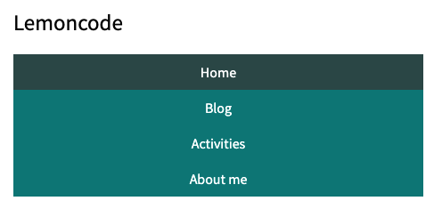

# Master_Frontend_Lemoncode_Mod1_Layout :lemon:

## Ejercicio 1: Crear una paleta de colores dinámica.

Usar el lenguaje Sass para crear distintos temas de paletas de colores.
La idea es partir de un color base, y a partir de ese color generar 4 colores más oscuros de manera gradual, y cuatro colores más claros de manera gradual.

## Ejercicio 2: Crear dos temas distintos y mostrar los resultados en una página.

Los cambios en el tema afectan a las siguientes características:

- Color 
- Fuente
- Border Radius
- Shadow Box

Para visualizar los cambios debería ser suficiente importar un tema u otro en el fichero de estilos principal.

  
  

## Ejercicio 3: Crear la barra de navegación de la imagen usando Flexbox.

La barra de navegación responde a distintas resoluciones. Utilizar media queries para conseguir este resultado.

  
  

## Ejercicio 4: Crearemos un elemento de tipo card con Grid CSS.

